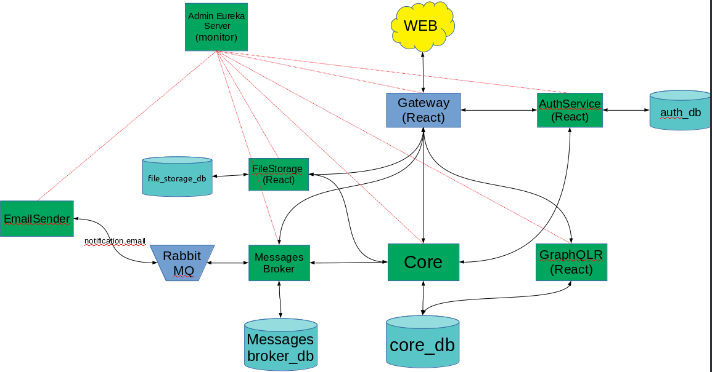

# Java-pet-project (Blogs)
This project helps me to learn java-technologies in which I am interested in practice.
This project is a backend server that is built on a Spring Boot. The server provides storage of user credentials, their articles and various searches on them.
---
## How to run backend without swarm mode?

```bash
% Go to root directory
#promt> cd Backend\

%            Build JARs
% For Linux
#promt> mvn clean install spring-boot:repackage -Dmaven.test.skip=true

% For Windows
#promt>

% Run docker-compose
#promt> docker-compose -f docker-compose-dev.yml up --build

% Check links(now did't work):
% http://localhost:8090/api/free/swagger-ui.html 
% http://localhost:8090/api/free/graphiql 
% http://localhost:8761/admin 
```
---
### Schema ###

---
### Token agreement ###
> Описание того, как используются служебные поля в _JWT_.
 - ___sub___ - Хранит __Id__ пользователя.
 - ___aud___ - Хранит тип токена: __access/refresh__.
 - ___claims___ - Хранит: __roles__ & __credentials__.
    - _"roles": "USER,ADMIN,WRITER"_
    - _"cred": "some,some"_
    
    
---
### Short Description of Services ###
#### Gateay ####
 - Балансировка запросов между сервисами.
 - Требует добавлять токены в запросы*.
 - Проверяет токены на устаревание.
 - Отсеивает запросы имеющие неправомерные uri.
 - Ограничивает кол-во запросов в сервису.
##### Short list of technologies were used:
* [Maven](https://maven.apache.org/) - Dependency Management
* [Spring Security](https://spring.io/projects/spring-security) - Authentication and access-control
* [Open Api 3](https://github.com/springdoc/springdoc-openapi) -  automating the generation of API documentation
* [Eureka](https://github.com/Netflix/eureka) - communication server for services
* [Jwt](https://github.com/jwtk/jjwt) - for working with jwt tokens
* [Redis](https://redis.io/) - NOSQL for caching
#### AuthService ####
 - Хранит Id, Login, Password, Roles, Credentials, AccessToken, RefreshToken  пользователя.
 - Генерирует новые пары токенов для пользователя (по паролю и refreshToken).
 - Изменение пароля пользователя.
##### Short list of technologies were used:
* [Maven](https://maven.apache.org/) - Dependency Management
* [Spring Security](https://spring.io/projects/spring-security) - Authentication and access-control
* [Open Api 3](https://github.com/springdoc/springdoc-openapi) -  automating the generation of API documentation
* [Eureka](https://github.com/Netflix/eureka) - communication server for services
* [Lombok](https://projectlombok.org/) - Code generator
* [Spring Data JPA](https://spring.io/projects/spring-data-jpa) - The web framework used
* [FlyWay](https://flywaydb.org/) - Version control for your database. Robust schema evolution across all your environments.
* [PostgreSQL](https://www.postgresql.org/) - SQL DB
* [Jwt](https://github.com/jwtk/jjwt) - for working with jwt tokens
* [WebFlux](https://docs.spring.io/spring-framework/docs/5.0.0.BUILD-SNAPSHOT/spring-framework-reference/html/web-reactive.html) - "Reactive Spring MVC "
#### FileStorage ####
 - Хранит файлы.
 - Отдаёт файлы по id.
 - Удаляет файлы, если те устарели.
##### Short list of technologies were used:
* [Maven](https://maven.apache.org/) - Dependency Management
* [Spring Security](https://spring.io/projects/spring-security) - Authentication and access-control
* [Open Api 3](https://github.com/springdoc/springdoc-openapi) -  automating the generation of API documentation
* [Eureka](https://github.com/Netflix/eureka) - communication server for services
* [Lombok](https://projectlombok.org/) - Code generator
* [Spring Data JPA](https://spring.io/projects/spring-data-jpa) - The web framework used
* [FlyWay](https://flywaydb.org/) - Version control for your database. Robust schema evolution across all your environments.
* [PostgreSQL](https://www.postgresql.org/) - SQL DB
* [Jwt](https://github.com/jwtk/jjwt) - for working with jwt tokens
* [Redis](https://redis.io/) - NOSQL for caching
* [WebFlux](https://docs.spring.io/spring-framework/docs/5.0.0.BUILD-SNAPSHOT/spring-framework-reference/html/web-reactive.html) - "Reactive Spring MVC "
#### NotificationResolver ####
  - Отправляет уведомления пользователям в различные источники через очереди в RabbitMQ.
  - Позволяет слать пользователям уведомления друг-другу.
##### Short list of technologies were used:
* [Maven](https://maven.apache.org/) - Dependency Management
* [Spring Security](https://spring.io/projects/spring-security) - Authentication and access-control
* [Open Api 3](https://github.com/springdoc/springdoc-openapi) -  automating the generation of API documentation
* [Eureka](https://github.com/Netflix/eureka) - communication server for services
* [Lombok](https://projectlombok.org/) - Code generator
* [Spring Web MVC](https://docs.spring.io/spring/docs/current/spring-framework-reference/web.html) - The web framework used
* [Spring Data JPA](https://spring.io/projects/spring-data-jpa) - The web framework used
* [FlyWay](https://flywaydb.org/) - Version control for your database. Robust schema evolution across all your environments.
* [PostgreSQL](https://www.postgresql.org/) - SQL DB
* [Jwt](https://github.com/jwtk/jjwt) - for working with jwt tokens
#### EmailSender ####
 - Отправляет письма на почту.
 - Собирает тело письма.
##### Short list of technologies were used:
* [Maven](https://maven.apache.org/) - Dependency Management
* [Spring Security](https://spring.io/projects/spring-security) - Authentication and access-control
* [Open Api 3](https://github.com/springdoc/springdoc-openapi) -  automating the generation of API documentation
* [Eureka](https://github.com/Netflix/eureka) - communication server for services
* [Lombok](https://projectlombok.org/) - Code generator
* [MailSender](https://docs.spring.io/spring/docs/1.0.0/javadoc-api/org/springframework/mail/javamail/JavaMailSender.html) - Email sender 
* [Jwt](https://github.com/jwtk/jjwt) - for working with jwt tokens
#### GraphQLR ####
 - Отдаёт пользователю информацию о:
   - Статьях.
   - Пользователях.
##### Short list of technologies were used:
* [Maven](https://maven.apache.org/) - Dependency Management
* [Spring Security](https://spring.io/projects/spring-security) - Authentication and access-control
* [Open Api 3](https://github.com/springdoc/springdoc-openapi) -  automating the generation of API documentation
* [Eureka](https://github.com/Netflix/eureka) - communication server for services
* [Lombok](https://projectlombok.org/) - Code generator
* [Spring Data JPA](https://spring.io/projects/spring-data-jpa) - The web framework used
* [Jwt](https://github.com/jwtk/jjwt) - for working with jwt tokens
* [Graphql](https://graphql.org/) - interactions between front and database
* [Redis](https://redis.io/) - NOSQL for caching
* [WebFlux](https://docs.spring.io/spring-framework/docs/5.0.0.BUILD-SNAPSHOT/spring-framework-reference/html/web-reactive.html) - "Reactive Spring MVC "
#### Core ####
 - Основная логика:
   - Заполняет БД статей и пользователей.
   - Отправляет запросы на уведомления о различных событиях.
##### Short list of technologies were used:
* [Maven](https://maven.apache.org/) - Dependency Management
* [Spring Security](https://spring.io/projects/spring-security) - Authentication and access-control
* [Open Api 3](https://github.com/springdoc/springdoc-openapi) -  automating the generation of API documentation
* [Eureka](https://github.com/Netflix/eureka) - communication server for services
* [Lombok](https://projectlombok.org/) - Code generator
* [Spring Web MVC](https://docs.spring.io/spring/docs/current/spring-framework-reference/web.html) - The web framework used
* [Spring Data JPA](https://spring.io/projects/spring-data-jpa) - The web framework used
* [PostgreSQL](https://www.postgresql.org/) - SQL DB
* [Jwt](https://github.com/jwtk/jjwt) - for working with jwt tokens
* [FlyWay](https://flywaydb.org/) - Version control for your database. Robust schema evolution across all your environments.
---
### List of technologies were used in project:
* [Docker](https://www.docker.com/) - images, compose, swarm
* [PostgreSQL](https://www.postgresql.org/) - SQL DB
* [Redis](https://redis.io/) - NOSQL for caching
* [RabbitMQ](https://www.rabbitmq.com/) - Messages broker
## License

This project is licensed under the MIT License - see the [LICENSE.md](LICENSE.md) file for details

## Acknowledgments

* Hat tip to anyone whose code was used
